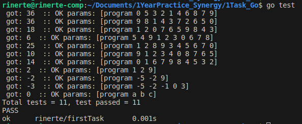

<h1>Task:</h1>
Дан одномерный массив А размерности N. Найти сумму отрицательных элементов, расположенных между максимальным и минимальным.  
Ответом на задачу будет ссылка на репозиторий GitHub, где хранится Ваша программа. Или иным удобным для Вас способом.

<h2>Variants how to execute/run/test</h2>
<h3>Must be installed GO </h3>
- Edit (optional) main_test.go then run:
     go test 
- Or:  
   go run main.go {numbers here} 
   Example: go run main.go 1 2 3 4 5

<h3>Tests result:</h3>

