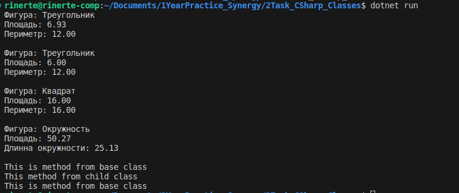

<h1>Task:</h1>
Написать тестовую программу, которая демонстрирует работу методов базового и производного классов.  
Ответом на задачу будет ссылка на репозиторий GitHub, где хранится Ваша программа. Или иным удобным для Вас способом.

<h2>Решение</h2>
Программа содержит базовый класс Geometry, его метод Show наследует дочерний абстрактный класс Figure. Классы Circle, Square, Triangle - реализуют интерфейс, определенный родительским классом и наследуют метод Show из класса Geometry.  
Программа написана на языке C#. Для запуска нужно перейти в директорию с программой и ввести команду 'dotnet run'

<h2>Результат работы программы:</h2>

