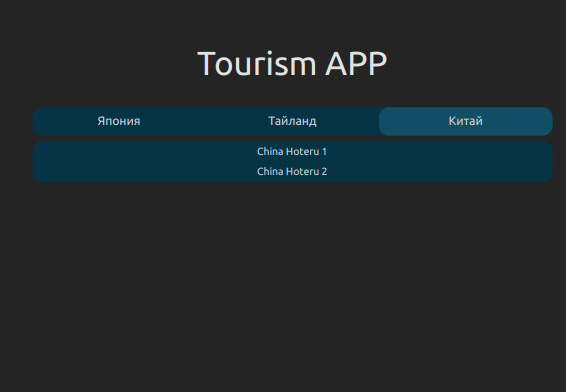
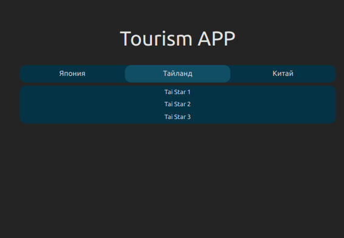
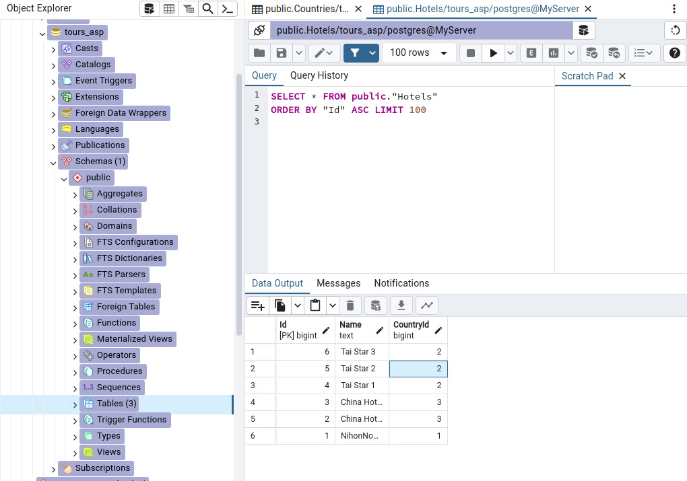
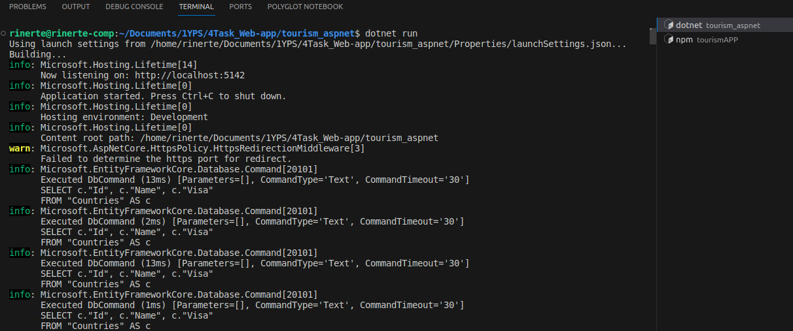
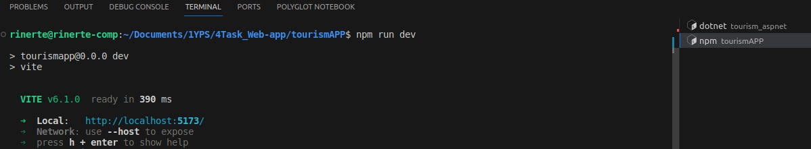

# Веб-приложение для управления турами (страны и отели)


Веб-приложение для просмотра списка стран и отелей в выбранной стране.
Тема приложения продолжает тему задания N3 в корневом репозитории (https://github.com/rinerte/1YearPractice_Synergy/)
Проект создан в рамках учебной практики в университете Синергия с использованием ASP.NET Core (бэкенд) и React (фронтенд).

---

## Технологии и инструменты

### Бэкенд
- **ASP.NET Core Web API** 
- **Entity Framework Core** 
- **PostgreSQL** 
- **pgAdmin** 

### Фронтенд
- **React** 
- **Vite** 
- **Tailwind CSS** 

### Инструменты
- Visual Studio Code
- npm 

---

## Установка и запуск

### 1. Настройка базы данных
- Установите PostgreSQL и создайте базу данных `tours_asp`.
- В файле `appsettings.json` (tourism_aspnet(development)) укажите строку подключения:
  ```json
  "ConnectionStrings": {
    "DefaultConnection": "Host=localhost;Port=5432;Database=tours_asp;Username=ваш_пользователь;Password=ваш_пароль"
  }
  ```
- Примените миграции EF Core:
```
dotnet ef database update
```
### 2. Запуск бэкенда
 - Перейдите в папку tourism_aspnet
```
cd tourism_aspnet
dotnet run
```
- сервер запустится на http://localhost:5142
### 3. Запуск фронтенда
 - Перейдите в папку tourismAPP
```
cd ..
cd tourismAPP
npm run dev
```
- приложение будет доступно на http://localhost:5173

## Структура проекта
### Бэкенд (ASP.NET Core)
#### Модели:
- Country (Страна: Id, Name, Visa)
- Hotel (Отель: Id, Name, CountryId)
#### Контроллеры:
 - CountriesController (GET /countries)
 - HotelsController (GET /hotels/{countryId})

### Фронтенд (React)
 - Главная страница отображает список стран.
 - При выборе страны отправляется запрос к API для получения отелей.

## Скриншоты
### Интерфейс приложения
 <br>
Рисунок 1: Список отелей в Китае

 <br>
Рисунок 2: Список отелей в Таиланде

### База данных

 <br>
Рисунок 3: Структура базы данных в pgAdmin

### Запуск проекта
 <br>
Рисунок 4: Бэкенд успешно запущен

 <br>
Рисунок 5: Фронтенд собран и готов к работе
